# CV Analyzer – AI-Powered Evaluation

**CV Analyzer** is an AI-integrated Rails application that evaluates candidate CVs and project submissions automatically using **LLMs (Large Language Models)**.  
It combines backend engineering, prompt design, retrieval (RAG), and resilience patterns in one cohesive system.

---

## Quick Setup

### Prerequisites
- Ruby **3.4+**, Rails **8.0+**
- PostgreSQL, Redis (for Sidekiq)
- OpenAI API key

### Installation

#### 1️⃣ Clone the repository
```bash
git clone https://github.com/tiffanyjoycelyn/cv-analyzer.git
cd cv-analyzer
bundle install
rails db:create db:migrate
```
#### 1️⃣ Clone the repository
```bash
git clone https://github.com/tiffanyjoycelyn/cv-analyzer.git
cd cv-analyzer
bundle install
rails db:create db:migrate
```
#### 1️⃣ Clone the repository
```bash
git clone https://github.com/tiffanyjoycelyn/cv-analyzer.git
cd cv-analyzer
bundle install
rails db:create db:migrate
```

#### 2️⃣ Install dependencies
```bash
bundle install
yarn install --check-files
```
#### 3️⃣ Configure environment variables
```bash
# .env
OPENAI_API_KEY=your_openai_api_key
LLM_MODEL=gpt-4o-mini
LLM_TEMPERATURE=0.2
```
#### 4️⃣ Set up the database
```bash
rails db:create
rails db:migrate
```
#### 5️⃣ Run background job processor (Sidekiq)
```bash
bundle exec sidekiq
```
#### 6️⃣ Run the Rails server
```bash
rails s
```
#### 7️⃣ Run Qdrant (Vector Database) locally
```bash
docker run -p 6333:6333 qdrant/qdrant
```
#### 8️⃣ Visit Swagger Docs
```bash
http://localhost:3000/api-docs
```


### System Overview

```mermaid
flowchart TD
  A[User Uploads CV & Project PDFs] --> B[Job + UploadedFile Records Created]
  B --> C[EvaluateJob Sidekiq Worker]
  C --> D[Text Extraction → Embedding → Retrieval → LLM Evaluation]
  D --> E[Results Stored in Database]
  E --> F[Accessible via API or Dashboard]
```

### System Architecture


### 🗄️ Database Schema

```mermaid
erDiagram
    USERS ||--o{ JOBS : "has many"
    USERS {
        int id PK
        string username
        string email
        string encrypted_password
        string role  "('user' or 'admin')"
        datetime created_at
    }

    JOBS ||--o{ JOB_DETAILS : "has many"
    JOBS ||--|| RESULTS : "has one"
    JOBS {
        int id PK
        int user_id FK
        string status "('pending', 'processing', 'completed', 'failed')"
        text error_message
        datetime created_at
    }

    JOB_DETAILS {
        int id PK
        int job_id FK
        int file_id FK
        string role "('cv' or 'project')"
        datetime created_at
    }

    UPLOADED_FILES ||--o{ JOB_DETAILS : "referenced by"
    UPLOADED_FILES {
        int id PK
        string file_name
        string file_type
        string path
        datetime created_at
    }

    RESULTS {
        int id PK
        int job_id FK
        float cv_match_rate
        float project_score
        text cv_feedback
        text project_feedback
        text overall_summary
        text raw_llm_response
        datetime created_at
    }
````
